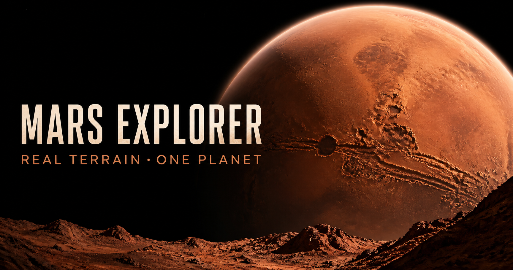

# Mars Explorer

An interactive 3D journey from Mars orbit to verified rover-camera archives on the surface.

[Open the live experience](https://mars-explorer-3d.raskkolnikovv.chatgpt.site/) · [Review the image provenance](public/mars-data/README.md)



## Highlights

- Explore a relief-displaced Mars globe built from MGS/MOLA-scale map data.
- Select historic landing sites and descend directly into their surface views.
- View mission-identified imagery from Sojourner, Spirit, Opportunity, Curiosity, Perseverance, and Zhurong.
- Follow the published Perseverance route between the included camera stations.
- Inspect an accelerated reference model of Mars Reconnaissance Orbiter's near-polar orbit.
- Use mouse, touch, keyboard, or fullscreen controls on desktop and mobile.

The explorer deliberately does not substitute one rover's imagery for another. PrOP-M is shown as a historical landing site without a panorama because no rover-camera photograph was returned.

## Controls

| Context | Mouse or touch | Keyboard |
| --- | --- | --- |
| Orbit | Drag to rotate, scroll or pinch to zoom, select a marker to visit it | Arrow keys rotate, `+` / `-` zoom |
| Surface | Drag or swipe to look around, scroll or pinch to zoom | Arrow keys look, `+` / `-` zoom, `0` resets the view |
| Anywhere | Use the on-screen interface to change locations or return to orbit | `H` hides the interface, `F` toggles fullscreen |

## Quick start

### Requirements

- Node.js 22.13 or newer
- npm

### Run locally

```bash
npm install
npm run dev
```

Open [http://localhost:3000](http://localhost:3000) in a browser.

### Available scripts

| Command | Purpose |
| --- | --- |
| `npm run dev` | Start the local development server |
| `npm run build` | Create a production build |
| `npm run start` | Serve the production build |
| `npm run lint` | Check the source with ESLint |

## Project structure

```text
app/
  mars/                 3D scene, navigation, mission data, and UI
  globals.css           Global styling and responsive behavior
  layout.tsx            Metadata and application shell
public/
  mars-data/            Terrain textures, routes, and rover imagery
  og.png                Social and repository preview
.openai/hosting.json    Hosting configuration
```

## Data and image provenance

The global surface uses Mars map and relief data derived from public planetary mission products. Rover panoramas retain their real photographed field of view; archive borders may be cropped, but missing sky or ground is not synthesized. The MRO path is a visual reference model rather than live telemetry.

Credits, asset-level notes, processing disclosures, and links to NASA, JPL, CNSA, USGS, and route sources are maintained in the [Mars surface asset manifest](public/mars-data/README.md).

## Contributing

Bug reports and focused improvements are welcome. Before changing mission imagery or scientific labels, read [CONTRIBUTING.md](CONTRIBUTING.md), which includes the project's source and verification requirements.

## License

No software license has been selected yet. Until one is added, all rights to the repository's original code and design remain with the repository owner. Third-party mission imagery and datasets remain subject to their respective source terms and credits.
